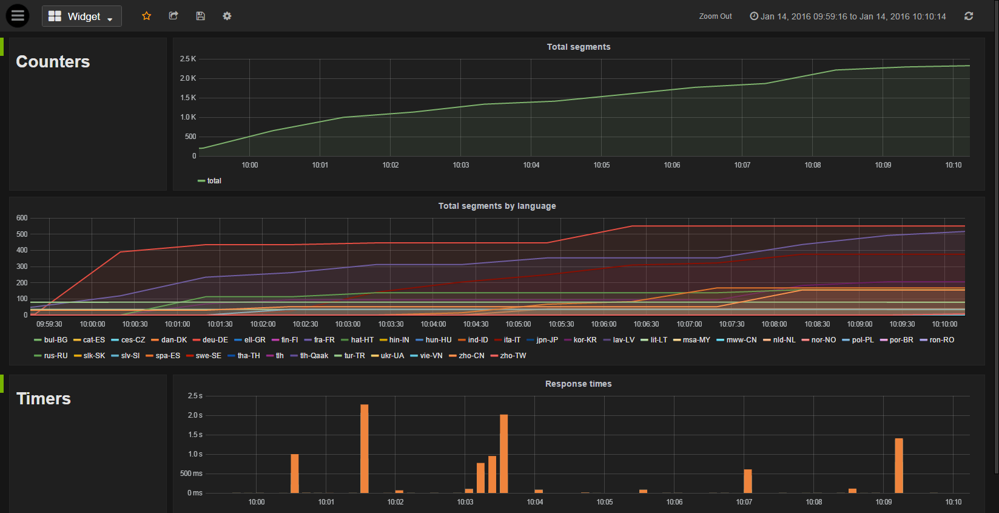

# Ochostats

Ochostats provides a ready to use <a href="https://github.com/autodesk-cloud/ochopod" target="_blank">Ochopod</a>-enabled <a href="https://github.com/etsy/statsd" target="_blank">StatsD</a>/<a href="http://graphite.readthedocs.org" target="_blank">Graphite</a>/<a href="http://grafana.org" target="_blank">Grafana</a> server.

## Instructions

You have two options to use Ochostats:
<ol>
<li>Either use the base image (pferrot/ochostats:1.0.7_20160329123700CEST_0.5.1) as is and e.g. customize dashboards from grafana UI once the container is up and running.</li>
<li>Or (recommended option) create your own Docker image by extending the Ochostats base image and include whatever customization you need (e.g. dashboards) directly within your base image. See the example under images/extend and follow the instructions below.</li>
</ol>

### Extending the base image

Use the files under images/extend as template and adapt to your needs as follows:
- Modify the Dockerfile:
  - Replace 'my_custom_salty_string' with your own random unique secret key for Graphite
  - *Optional*: Configure the Django timezone (search for 'Set your local timezone' in Dockerfile) - defaults to 'America/Los_Angeles'
- *Optional*: configure schemas definitions and aggregation methods for Whisper files by modifying the files under images/extend/resources/carbon
- *Optional*: customize Grafana (e.g. enable anonymous access) by editing *both* images/extend/resources/grafana_init/grafana.ini and 
  images/extend/resources/grafana_init/templates/grafana.ini. The first one is used for the creation of the Docker image and the second one 
  is the template that is used to create the actual grafana.ini file used by Grafana at runtime. The template allows to pass some dynamic configuration to Grafana (e.g. its root URL),
  which is convenient for reusing the same image in different contexts (e.g. dev, staging, production,...)
- *Optional*: customize StatsD by editing the file images/extend/resources/statsd/config.js
- *Optional*: modify the default Grafana admin password by editing the file images/extend/resources/grafana_init/change_admin_password.json
- *Optional*: modify the Grafana main org name by editing the file images/extend/resources/grafana_init/update_org_name.json
- *Optional*: create default dashboards by addind .json files under images/extend/resources/grafana_init/dashboards
- Build the image with 'docker build .' from images/extend/resources
- Tag and push your image to Docker Hub (or whatever repository you are using)
- Modify the file images/extend/resources/ochothon_custom-ochostats.yml:
  - Set a valid cluster name
  - Replace &lt;your_image_name_here&gt; with the name of the image that you just built

### Deploying Ochostats

Regardless of the option that you choose (using the base image directly or creating your own one):
- Deploy your image to you Mesos/Marathon cluster with <a href="https://github.com/autodesk-cloud/ochothon" target="_blank">Ochothon</a> thanks to the file ochothon-ochostats.yml or ochothon_custom-ochostats.yml that you just modified (depending on the option that you choose)
- Configure your Ochopod clusters that you want to submit metrics to depend on 'ochostats' (or whatever name you gave it) and send StatsD metrics to Ochostats UDP port 8125 (this is the container port - use Ochopod as usual to send the packets to the proper host and port)
- Access the Grafana UI at http://&lt;ochostats_host&gt;:3000 (get the IP/host thanks to Ochothon or the Marathon UI) and start monitoring and building beautiful graphs
  
## Release notes

### 0.5.1 (12/14/2016)
- Use PostgreSQL as database for Grafana

### 0.5 (12/14/2016)
- Upgraded Grafana to version 4.0.2 (which supports alerting!!!)

### 0.4 (7/20/2016)
- Upgraded Graphite to version 0.9.15 (used to be version 0.9.12)
- Upgraded Ochopod version (now using base image autodeskls/ochopod:1.0.7_20160329123700CEST) 

### 0.3.1 (4/11/2016)
- Allow to specify Grafana 'session' parameters when deploying Ochostats (see example in images/extend/resources/ochothon_custom-ochostats.yml)

### 0.3 (3/23/2016)
- All subprocesses (Apache2, Grafana, StatsD, Carbon and PostgreSQL) are now monitored by Ochopod
- Using template file for grafana.ini: this allows to pass dynamic Grafana configuration when deploying Ochostats (e.g. Grafana root URL)

### 0.2 (1/13/2016)
- Existing base image (pferrot/ochostats:1.0.6_20151029154900CET_0.2) with instructions on how to extend it
- Created datasource marked as default datasource
- Fixed bug preventing PostgreSQL from starting up due to file permission issue
- Fixed bug preventing Carbon from starting up due to stale PID file

### 0.1 (12/07/2015)
- First version

## Screenshots 
